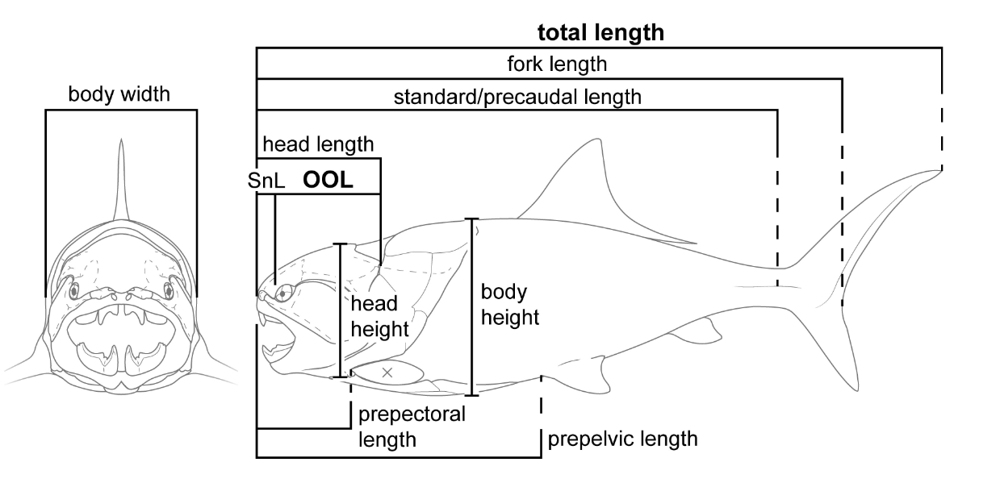

```{r setup, include=FALSE}
knitr::opts_chunk$set(echo = FALSE)
library(knitr)
library(ggplot2)
library(dplyr); options(dplyr.summarise.inform = FALSE) # remove summarise warnings
```


## Fish data {.build}

Dataset on the total length of fishes, depending on their head's size **Engelman, 2023**

>- *total_length* : total length, in cm
>- *OOL* : Orbit-Opercular Length, in cm
>- *head_height* : head height, in cm
>- *HC_fin* : is the caudal fin heterocercal or not (ie. assymetric)


The original goal of this data-set was to be able to determine the length of extinct placoderm fishes where only the armored head fossilized.


<!-- -->


## Fish data 2 {.build}


```{r diamond data, echo=TRUE}
# Read in the file, with character columns as factors
fish_data <- read.csv("data/devonian_fish_tale.simple.csv", stringsAsFactors = TRUE , row.names = 1)
head(fish_data)
```

<span class="question">Question: how are fishes distributed over the categorical variables?</span>

>- <span class="code">geom_bar</span>

## Fish categories {.build}

<div class="columns-2">

```{r fish data histogram ggplot Color fake, echo=TRUE, eval=FALSE}
# plot bar chart of Color
ggplot(fish_data, aes(x = higher_group)) +
  geom_bar(col = "darkorange", alpha = 0.5) 
```

```{r, eval=TRUE, echo=FALSE}
fish_data_old <- fish_data
```

```{r fish group summary fake, eval=FALSE, echo=TRUE}
summary(fish_data$higher_group)
```

```{r select cat variable}
  selectInput("cat_variable", "Categorical variable:",
  c("higher_group", "swimbladder", "HC_fin"))
```

```{r fish cat summary, eval=TRUE, echo=FALSE}
renderPrint(

    summary(fish_data[, which(colnames(fish_data) == input$cat_variable)])

)
```

<p class="forceBreak">&nbsp;</p>

<div class="centered">
```{r fish data histogram ggplot Color, echo=FALSE}
# plot histograms
renderPlot({
  local_data <- fish_data_old

ggplot(local_data, aes_string(x = input$cat_variable)) + theme_bw() + theme(text = element_text(size = 18)) +
  geom_bar(col = "darkorange", fill = "darkorange", alpha = 0.5) + coord_flip()
}, width = 450, height = 300)
```
</div>
</div>


<span class="question">Question: What about the continuous variables?</span>


## Fish continuous {.build}

<div class="columns-2">
  
```{r fish data histogram ggplot Price fake log, echo=TRUE, eval=FALSE}
ggplot(fish_data, aes(x = OOL, 
                         y = ..density..)) + # histogram of Price
  geom_histogram(col = "darkorange", alpha = 0.5) 
```

```{r fish price summary fake log, eval=FALSE, echo=TRUE}
summary(fish_data$OOL)
```

```{r select cont variable log again}
selectInput("cont_variable_a", "Continuous variable:",
            c('total_length',"head_height", "OOL"))
```

```{r diamond cont summary log, eval=TRUE, echo=FALSE}
renderPrint(
  if (input$log_transform) {
    summary(fish_data[, which(colnames(fish_data) == paste0("log_", input$cont_variable_a))]) 
  } else {
    summary(fish_data[, which(colnames(fish_data) == input$cont_variable_a)]) 
  }
)
```

<span class="question">Question: Shall we log-transform?</span>
  
<p class="forceBreak">&nbsp;</p>

<div class="centered">
```{r fish data histogram ggplot Price log, echo=FALSE}
# plot histogram of price
renderPlot({
  local_var <- input$cont_variable_a
  if (input$log_transform) {
    local_var <- paste0("log_", local_var)
  }
  ggplot(fish_data, aes_string(x = local_var, y = "..density..")) + 
    theme_bw() + theme(text = element_text(size = 18)) +
    geom_histogram(bins = 20, col = "darkorange", fill = "darkorange", alpha = 0.5) 
}, width = 450, height = 300)
```
</div>
  
```{r log checkbox}
checkboxInput("log_transform", "Log transform?", value = FALSE)
```

</div>
  
<div id="hidestuffless">

```{r, log transform, eval=TRUE, echo=TRUE}
fish_data$log_total_length <- log(fish_data$total_length)
fish_data$log_OOL <- log(fish_data$OOL)
fish_data$log_head_height <- log(fish_data$head_height)
```
</div>
  
## total_length vs OOL  {.build}

<div class="columns-2">
  
```{r fish data scatter ggplot fake, echo=TRUE, eval=FALSE}
ggplot(fish_data, aes(x = log_OOL, 
                         y = log_total_length)) +
  # add box plots with transparency
  geom_point(colour = "dodgerblue", 
               alpha = 0.5) +
  # and font size and theme
  theme_bw() +
  theme(text = element_text(size = 18))
```


```{r select cont variable log again2}
selectInput("cont_variable_b", "Continuous variable:",
            c("head_height", "OOL",
              "log_head_height", "log_OOL"))
```


<p class="forceBreak">&nbsp;</p>

<div class="centered">
```{r fish data scatter ggplot, echo=FALSE}
# plot histogram of price
renderPlot({
  local_var <- input$cont_variable_b
  if (input$log_transform) {
    local_var <- paste0("log_", local_var)
  }
  ggplot(fish_data, aes_string(x = local_var, 
                         y = "log_total_length")) +
  # add box plots with transparency
  geom_point(colour = "dodgerblue", 
               alpha = 0.5) +
  # and font size and theme
  theme_bw() +
  theme(text = element_text(size = 18))
}, width = 450, height = 300)
```
</div>

</div>
  
<div id="hidestuffless">
<span class="question">Question: how does the categorical variable factor there?</span>
</div>
  

## total_length vs OOL  {.build}

<div class="columns-2">
  
```{r fish data scatter ggplot col fake , echo=TRUE, eval=FALSE}
ggplot(fish_data, aes(x = log_OOL, 
                      y = log_total_length,
                      colour = HC_fin)) +
  # add box plots with transparency
  geom_point(alpha = 0.5) +
  # and font size and theme
  theme_bw() +
  theme(text = element_text(size = 18))
```


```{r select cont variable log again3}
selectInput("cont_variable_c", "Continuous variable:",
            c("head_height", "OOL",
              "log_head_height", "log_OOL"))
```
```{r select cat variable log again2}
selectInput("cat_variable_c", "Categorical variable:",
            c("HC_fin", "swimbladder", "higher_group"))
```


<p class="forceBreak">&nbsp;</p>

<div class="centered">
```{r fish data scatter ggplot col, echo=FALSE}
# plot histogram of price
renderPlot({
  local_var <- input$cont_variable_c
  local_var2 <- input$cat_variable_c
  if (input$log_transform) {
    local_var <- paste0("log_", local_var)
  }
  ggplot(fish_data, aes_string(x = local_var, 
                         y = "log_total_length", 
                         colour=local_var2)) +
  # add box plots with transparency
  geom_point(alpha = 0.5) +
  # and font size and theme
  theme_bw() +
  theme(text = element_text(size = 18))
}, width = 450, height = 300)
```
</div>

</div>
  
<div id="hidestuffless">

  <span class="answer">Answer: fish with a heterocercal caudal fin may have a different relationship than those without.</span>
  
  <span class="question">Question: Which model could we build to start to account for this?</span>
  
  <span class="answer">Answer:</span>
  
  $$\mathrm{log\_total_length} = \beta_0 + \beta_1\mathrm{log\_OOL} +\beta_2\mathrm{heterocercal\_caudal\_fin} +\varepsilon$$


</div>


## Multiple regression {.build}
  
<div>
<div id=hidestuff style="float: right; clear: right;"><span class="code">base R</span> </div>
  With the <span class="code">lm(...)</span> function
</div>
  
```{r linear regression diamond, eval=TRUE, echo=TRUE}
lm_fish_fit <- lm(log_total_length ~ log_OOL + HC_fin, fish_data)
summary(lm_fish_fit)$coefficients
```

>- *log_OOL* row contains $\beta_1$ which is the slope when there is not heterocercal caudal fin
>- *HC_finTRUE* rows are the offset compared to the baseline (no heterocercal caudal fin)


<span class="question">Question: How much would the predicted *log_OOL* change if we increase the *log_OOL* size by 0.4 ?</span>
  
  <span class="answer">Answer: 0.4*(`r round(summary(lm_fish_fit)$coefficients[2, 1], 4)`) = `r round(0.4*(summary(lm_fish_fit)$coefficients[2, 1]) , 4)`. </span>
  

## Predicted values
  
<div class="columns-2">
  
```{r diamond price vs size and colour lines fake, echo=TRUE, eval=FALSE}
mod<-lm(log_total_length~log_OOL+HC_fin,data=fish_data)
local_data<-cbind(fish_data,predict(mod,interval="confidence"))

ggplot(local_data, aes(x = log_OOL, 
                      y = log_total_length, 
                      colour = HC_fin)) +
  # add points with outline 
  geom_point(size = 2) +
  # add the fit lines with fixed slope  
  geom_line(aes(y=fit, group=HC_fin),col='black') +
  # and font size and theme
  theme_bw() + 
  theme(text = element_text(size = 18))
```

<p class="forceBreak">&nbsp;</p>
  
  <div class="centered">
```{r diamond size vs colour lines, echo=FALSE, eval=TRUE}
renderPlot({
# colour the size data by the colour
mod<-lm(log_total_length~log_OOL+HC_fin,data=fish_data)
local_data<-cbind(fish_data,predict(mod,interval="confidence"))

ggplot(local_data, aes(x = log_OOL, 
                      y = log_total_length, 
                      colour = HC_fin)) +
  # add points with outline 
  geom_point(size = 2) +
  # add the fit lines with fixed slope  
  geom_line(aes(y=fit, group=HC_fin),col='black') +
  # and font size and theme
  theme_bw() + 
  theme(text = element_text(size = 18))
}, width = 450, height = 450)
```
  </div>
</div>
  
<span class="question">Question: should the lines all have the same slope?</span>


## Interactions {.build}
  
<div>
If $x_1$ is continuous and $x_2$ categorical with $(K+1)$ categories, in the regression

$$y = \beta_0 + \beta_1 x_1 + \beta_2 x_2 + \epsilon$$
</div>
  
<div>
  The predicted values are

$$\widehat{y} = \left\{ \begin{array}{ccc}\beta_0 + \beta_1x_1 & & k=0 \\
\beta_0 + \beta_1x_1 + \beta_{2,k} && k>0 \end{array} \right.$$
  
  >- $k$ is the category of $x_2$, changes the intercept
</div>
  
<div>
  To change the slope, we add the <span class="def">interaction</span> term
  
$$y = \beta_0 + \beta_1 x_1 + \beta_2 x_2 + \beta_3x_1x_2+ \epsilon$$
</div>
    
<span class="question">Question: What are the predicted values?</span>
      
<div>
<span class="answer">Answer:</span>
        
 $$\widehat{y} = \left\{ \begin{array}{ccc}\beta_0 + \beta_1x_1 & & k=0 \\
        \beta_0 + \beta_1x_1 + \beta_{2,k} + \beta_{3,k}x_1 && k>0 \end{array} \right.$$
</div>
          
## Interaction terms {.build}
          
<div>
<div id=hidestuff style="float: right; clear: right;"><span class="code">base R</span> </div>
With the <span class="code">lm(...)</span> function
</div>
              
```{r linear regression diamond two, eval=TRUE, echo=TRUE}
lm_fish_fit2 <- lm(log_total_length ~ log_OOL*HC_fin, fish_data) # includes linear terms too
summary(lm_fish_fit2)$coefficients
```
            
>- *log_OOL:HC_fin* rows correspond to the change in slope compared to the baseline `HC_fin == FALSE`

## Predicted values with interactions {.build}

<div class="columns-2">

```{r diamond price vs size and colour lines interactions fake, echo=TRUE, eval=FALSE}
# colour the price size data by the colour
ggplot(fish_data, aes(x = log_OOL,
    y = log_total_length, colour = HC_fin)) +
    # add points
    geom_point(aes(colour = HC_fin), size = 2) +
    geom_point(shape = 23, size = 2, alpha = 0.5) +
        # add the fit lines without specifying slope
    geom_smooth(method = lm, aes(group=HC_fin) , color='black') +
    # and font size and theme
    theme_bw() +
    theme(text = element_text(size = 18))
```

<p class="forceBreak">&nbsp;</p>

<div class="centered">
```{r diamond size vs colour lines interactions, echo=FALSE, eval=TRUE}
# colour the size data by the colour
renderPlot({
  ggplot(fish_data, aes(x = log_OOL,
    y = log_total_length, colour = HC_fin)) +
    # add points
    geom_point(aes(colour = HC_fin), size = 2) +
    geom_point(shape = 23, size = 2, alpha = 0.5) +
        # add the fit lines without specifying slope
    geom_smooth(method = lm, aes(group=HC_fin) , color='black') +
    # and font size and theme
    theme_bw() +
    theme(text = element_text(size = 18))
}, width = 450, height = 450)
```
</div>
</div>

<span class="question">Question: What about other covariates?</span>


<!-- ## Residuals and covariates {.build} -->

<!-- <div> -->
<!-- ```{r diamond data scatterplot ggplot residuals different} -->
<!-- sidebarPanel( -->
<!--   selectInput("colour_variable", "Colour by:", -->
<!--               c("HC_fin",  -->
<!--                 "higher_group",  -->
<!--                 "swimbladder", -->
<!--                 "head_height")), width = 2 -->
<!-- ) -->
<!-- renderPlot({ -->
<!--   local_df <- fish_data -->
<!--   local_df$resid <- lm_fish_fit2$residuals -->
<!--   local_df$fitted <- lm_fish_fit2$fitted   -->
<!--   pp <- ggplot(local_df, aes(x = fitted, y = resid)) -->
<!--   if (input$colour_variable == "HC_fin") { -->
<!--     pp <- pp +  geom_point(aes(colour = HC_fin), size = 3, alpha = 0.5)  -->
<!--   } -->
<!--   if (input$colour_variable == "higher_group") { -->
<!--     pp <- pp +  geom_point(aes(colour = higher_group), size = 3, alpha = 0.5)  -->
<!--   } -->
<!--   if (input$colour_variable == "swimbladder") { -->
<!--     pp <- pp +  geom_point(aes(colour = swimbladder), size = 3, alpha = 0.5) -->
<!--   } -->
<!--   if (input$colour_variable == "head_height") { -->
<!--     #pp <- pp +  geom_point(aes(colour = log_head_height), size = 3, alpha = 0.5) -->
<!--     pp = ggplot(local_df, aes(x = log_head_height, y = resid))+geom_point() -->
<!--   } -->
<!--   pp <- pp + -->
<!--     # change axes labels   -->
<!--     xlab(expression(hat(y))) + ylab(expression(epsilon)) + -->
<!--     # change theme  -->
<!--     theme_bw() +  -->
<!--     # and font size   -->
<!--     theme(text = element_text(size = 18)) -->
<!--   print(pp) -->
<!-- }, width = 800, height = 400) -->
<!-- ``` -->

<!-- <span class="question">Question: What about the other covariates?</span> -->
<!-- </div> -->

<!-- <span class="answer">Answer: There is a clear dependence on *...*, and a weaker one on *...*.</span> -->

              
## Adding head_height to the model

<div>
<div id=hidestuff style="float: right; clear: right;"><span class="code">base R</span> </div>
With the <span class="code">lm(...)</span> function
</div>
              
```{r linear regression diamond three first half, eval=TRUE, echo=TRUE}
lm_fish_fit3 <- lm(log_total_length ~ (log_OOL+log_head_height)*HC_fin, fish_data)
summary(lm_fish_fit3)$coefficients
```

>- the *head_height* does not seem to add much to the model


## Bayesian multiple regression {.build}

<div>
  <div id=hidestuff style="float: right; clear: right;"><span class="code">Stan</span> </div>
  For the Bayesian version with <span class="code">brms</span> we can easily use the same syntax
</div>
  
```{r, echo = TRUE, eval = FALSE, message=FALSE, warning=FALSE}
brmfit_fishes <- brm(log_total_length ~ (log_OOL+log_head_height)*HC_fin, fish_data) # run the model
```

```{r, echo = FALSE, eval = TRUE, message=FALSE, warning=FALSE}
library(brms) # load the library
source("./ibswrfiles/brm_run.R")
brmfit_fishes <- run_model(brm(log_total_length ~ (log_OOL+log_head_height)*HC_fin, fish_data), "./brm_models_lectures/fishes")
```

Note that this version has

>- default priors and identity (not log) link for $\sigma$ 
>- default chain lengths (2000 iterations)

To check convergence, we can look again at trace plots, eg

<div class="columns-2">
  
```{r, echo = FALSE, eval = TRUE, fig.height=2, fig.width=4.5, warning=FALSE, message=FALSE, fig.align = 'center'}
mcmc_plot(brmfit_fishes, variable = "b_HC_finTRUE", type = "trace")
```

<p class="forceBreak">&nbsp;</p>
  
```{r, echo = FALSE, eval = TRUE, fig.height=2, fig.width=4.5, warning=FALSE, message=FALSE, fig.align = 'center'}
mcmc_plot(brmfit_fishes, variable = "sigma", type = "trace")
```
</div>
  
<div id=hidestuffless>
  But there are many regression coefficients to plot
</div>


## Bayesian multiple regression convergence {.build}

<div>
<div id=hidestuff style="float: right; clear: right;"><span class="code">Stan</span> </div>
For the Bayesian version with <span class="code">brms</span> we can easily use the same syntax
            
```{r, echo = TRUE, eval = FALSE, message=FALSE, warning=FALSE}
brmfit_fishes <- brm(log_total_length ~ (log_OOL+log_head_height)*HC_fin, fish_data) # run the model
```
</div>
  
Automatic measures of convergence:
  
<div class="columns-2">
  
```{r, echo = TRUE, eval = TRUE, warning=FALSE, message=FALSE}
#rhat(brmfit_diamonds)
summary(brmfit_fishes)$fixed$Rhat
```

$\hat{R}$, ratio of between chain to in-chain sds

>- should be close to 1 (less than 1.05) 

<p class="forceBreak">&nbsp;</p>
  
```{r, echo = TRUE, eval = TRUE, warning=FALSE, message=FALSE}
summary(brmfit_fishes)$fixed$Tail_ESS
```

Effective Sample Size (ESS), estimate of equivalent number of independent samples

>- should be in the 100s

</div>
  
If not, we need to increase the chain lengths (`warmup` and `iter` parameters)


## Regression coefficients

We are interested in the regression coefficients of *OOL* and *head_height*
  
<div class="columns-2">
  
```{r, echo = TRUE, eval = TRUE, fig.height=3.5, fig.width=4.5, warning=FALSE, message=FALSE, fig.align = 'center'}
mcmc_plot(brmfit_fishes, variable = "*log_OOL",
          regex = TRUE, type = "intervals")
```


<p class="forceBreak">&nbsp;</p>
  
```{r, echo = TRUE, eval = TRUE, fig.height=3.5, fig.width=4.5, warning=FALSE, message=FALSE, fig.align = 'center'}
mcmc_plot(brmfit_fishes, variable = "*log_head_height",
          regex = TRUE, type = "intervals")
```

</div>
  
<div id="hidestuffless">
  ...
</div>


## Interaction effects 

And the **interaction** regression coefficients of *OOL* and *head_height* with *HC_fin*


```{r, echo = TRUE, eval = TRUE, fig.height=3.5, fig.width=4.5, warning=FALSE, message=FALSE, fig.align = 'center'}
mcmc_plot(brmfit_fishes, variable = "*HC*",
        regex = TRUE, type = "intervals")
```


<div id="hidestuffless">
At best a weak effect for *head_height*, but a stronger one for *OOL*
</div>

## Summary {.build}

<div>
For multiple linear regression

$$ y = \beta_0 + \beta_1 x_1 + \beta_2 x_2 + \ldots + \epsilon $$

>- the predicted value is the linear combination of the terms
</div>

<div>
Allows adjustment for confounding factors
</div>

<div>
We may need to <span class="def">transform</span> continuous variables

>- for example <span class="def">log</span> transformation, or log-linkage
</div>

<div>
With <span class="code">brms</span> can again easily run <span class="def">Bayesian</span> multiple regression

>- with the same regression formula syntax <span class="code">bf(... ~ ...)</span>
</div>

<div>
We can also easily include <span class="def">interaction</span> between variables
</div>

<div>
Model checking (and prior definitions!) more involved
</div>

<div>
$\rightarrow$ Exercises 7
</div>


